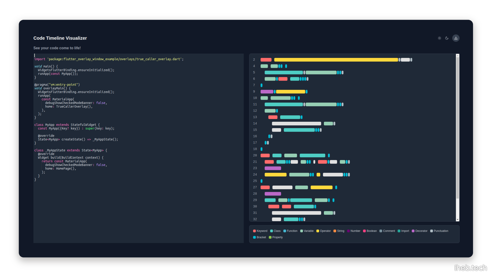

### Code Visualizer:

**Transforming Code into Engaging Visual Timelines**

Code Visualizer is a web application that generates colorful visualizations from code inputs, highlighting different segments for improved readability and engagement.

Find Code Visualizer at the following URL:

[codevi.netlify.com](https://codevi.netlify.app/) 